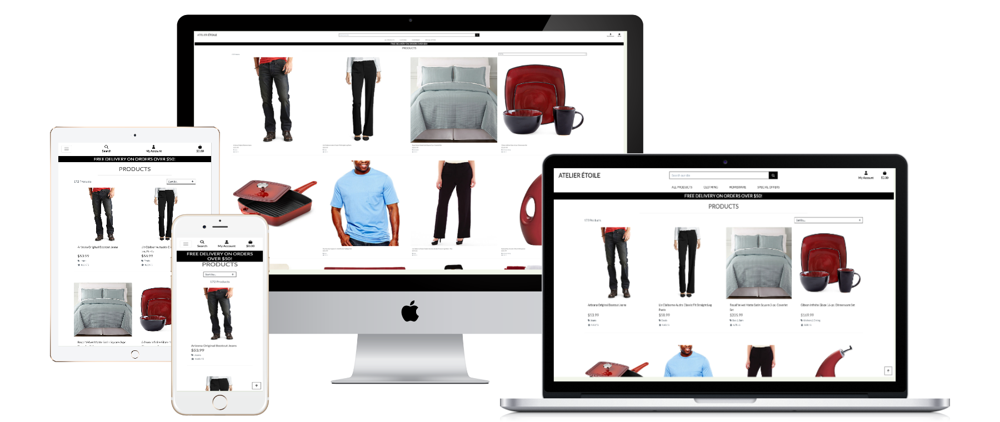
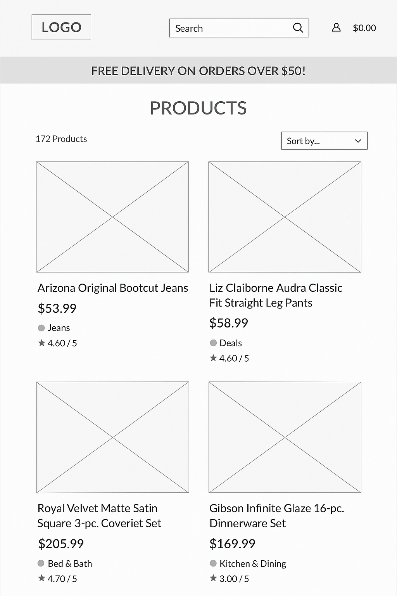
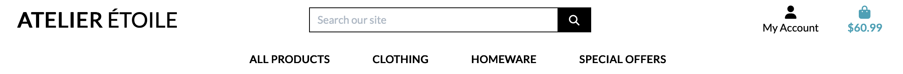

<!-- START doctoc generated TOC please keep comment here to allow auto update -->
<!-- DON'T EDIT THIS SECTION, INSTEAD RE-RUN doctoc TO UPDATE -->
**Table of Contents**  *generated with [DocToc](https://github.com/thlorenz/doctoc)*

- [Atelier Étoile](#atelier-%C3%89toile)
    - [A link to the deployed live page](#a-link-to-the-deployed-live-page)
  - [Overview](#overview)
  - [Requirements](#requirements)
  - [User Stories](#user-stories)
    - [View products](#view-products)
      - [As a **Shopper,** I can **view a list of products** so that **I can select some to purchase**](#as-a-shopper-i-can-view-a-list-of-products-so-that-i-can-select-some-to-purchase)
    - [Product details](#product-details)
      - [As a **Shopper,** I can **view individual product details** so that **I can identify the price, description, product rating, product image and available sizes**](#as-a-shopper-i-can-view-individual-product-details-so-that-i-can-identify-the-price-description-product-rating-product-image-and-available-sizes)
    - [Special offers](#special-offers)
      - [As a **Shopper,** I can **quickly identify deals, clearance items and special offers** so that **take advantage of special savings on products I'd like to purchase**](#as-a-shopper-i-can-quickly-identify-deals-clearance-items-and-special-offers-so-that-take-advantage-of-special-savings-on-products-id-like-to-purchase)
    - [View total](#view-total)
      - [As a **Shopper,** I can **easily view the total of my purchases at any time** so that **avoid overspending**](#as-a-shopper-i-can-easily-view-the-total-of-my-purchases-at-any-time-so-that-avoid-overspending)
    - [Registration](#registration)
      - [As a **Site User** I want to **easily register for an account** so that **I have a personal account and can view my profile**](#as-a-site-user-i-want-to-easily-register-for-an-account-so-that-i-have-a-personal-account-and-can-view-my-profile)
    - [Login Logout](#login-logout)
      - [As a **Site User** I want to **easily login or logout** so that **I can access my personal account information**](#as-a-site-user-i-want-to-easily-login-or-logout-so-that-i-can-access-my-personal-account-information)
    - [Password recovery](#password-recovery)
      - [As a **Site User** I want to **easily recover my password in case I forget it** so that **I can recover access to my account**](#as-a-site-user-i-want-to-easily-recover-my-password-in-case-i-forget-it-so-that-i-can-recover-access-to-my-account)
    - [Email confirmation](#email-confirmation)
      - [As a **Site User** I want to **receive an email confirmation after registering** so that **I can verify my account registration was successful**](#as-a-site-user-i-want-to-receive-an-email-confirmation-after-registering-so-that-i-can-verify-my-account-registration-was-successful)
    - [Personal user information](#personal-user-information)
      - [As a **Site User** I want to **have a personalised user profile** so that **I can view my personal order history and order confirmations, and save my payment information**](#as-a-site-user-i-want-to-have-a-personalised-user-profile-so-that-i-can-view-my-personal-order-history-and-order-confirmations-and-save-my-payment-information)
    - [Sort the products](#sort-the-products)
      - [As a **Site User** I want to **sort the list of available products** so that **I can easily identify the best rated, the best priced and categorically sorted products**](#as-a-site-user-i-want-to-sort-the-list-of-available-products-so-that-i-can-easily-identify-the-best-rated-the-best-priced-and-categorically-sorted-products)
  - [Wireframes](#wireframes)
    - [Home page](#home-page)
  - [Features](#features)
  - [Technology Stack](#technology-stack)
  - [Code](#code)
      - [Files](#files)
      - [Environment variables (env.py)](#environment-variables-envpy)
      - [Database Configuration (settings.py & dj_database_url)](#database-configuration-settingspy--dj_database_url)
      - [Loose Coupling with urls.py](#loose-coupling-with-urlspy)
      - [Admin pages](#admin-pages)
      - [References in settings.py](#references-in-settingspy)
      - [AllAuth](#allauth)
      - [Email](#email)
      - [Templates and views](#templates-and-views)
        - [AllAuth](#allauth-1)
        - [Base template](#base-template)
          - [Overview](#overview-1)
          - [Template Loading](#template-loading)
          - [Shopping Bag Summary](#shopping-bag-summary)
          - [Message Toasts](#message-toasts)
        - [Home index.html](#home-indexhtml)
      - [Templates within includes directory.](#templates-within-includes-directory)
        - [Categories](#categories)
        - [mobile_top_header.html](#mobile_top_headerhtml)
        - [main-nav.html](#main-navhtml)
        - [Products template](#products-template)
        - [Shopping Bag Template Documentation (bag.html)](#shopping-bag-template-documentation-baghtml)
          - [Page Structure](#page-structure)
          - [Shopping Bag Layout](#shopping-bag-layout)
        - [Product details](#product-details-1)
      - [Products app](#products-app)
        - [products/models.py](#productsmodelspy)
        - [base.css](#basecss)
        - [Later changes](#later-changes)
      - [Code format](#code-format)
      - [Code understandability](#code-understandability)
      - [Code validation](#code-validation)
  - [System Architecture](#system-architecture)
  - [Database Design](#database-design)
  - [Deployment](#deployment)
  - [I want my background image to work via Cloudinary. I replace /media/homepage_background_cropped.jpg in base.css with the Cloudinary URL.](#i-want-my-background-image-to-work-via-cloudinary-i-replace-mediahomepage_background_croppedjpg-in-basecss-with-the-cloudinary-url)
  - [Setup Instructions](#setup-instructions)
    - [Prerequisites](#prerequisites)
    - [Installation](#installation)
    - [Environment Variables](#environment-variables)
    - [Run Locally](#run-locally)
  - [Testing](#testing)
  - [Future Enhancements](#future-enhancements)
  - [Credits](#credits)

<!-- END doctoc generated TOC please keep comment here to allow auto update -->

# Atelier Étoile


A fully featured **Django-based e-commerce web application** that demonstrates secure payment processing, robust authentication, and modern deployment practices.



### Heroku hosted live page
[Live Site](https://milestone4ecommerce-6c0c8f5c0454.herokuapp.com)

---

## Overview

This project was built as part of my ongoing exploration of **Django web application development**. It implements a complete e-commerce solution with product management, order handling, Stripe-based payments, and secure user authentication.

The goal is to demonstrate the ability to build and deploy a production-grade Django application with a cloud-hosted database and static/media asset management via Heroku.

This project demonstrates the use of Django Template Language (DTL) to build a reusable base layout with Bootstrap for styling. The base template provides a consistent navigation bar, footer, and message display system across all pages.

## Requirements

The site owner wants readers to enjoy using the site. With that in mind the pages should be visually appealing at the same time simple to use.

The site should be responsive, adapting to all screen sizes.

## User Stories

### View products
#### As a **Shopper,** I can **view a list of products** so that **I can select some to purchase**

- When a category of products is clicked on a listing is seen.

### Product details
#### As a **Shopper,** I can **view individual product details** so that **I can identify the price, description, product rating, product image and available sizes**

- When a product is clicked on it's details are visible.

### Special offers
#### As a **Shopper,** I can **quickly identify deals, clearance items and special offers** so that **take advantage of special savings on products I'd like to purchase**

- A navigation link that allows me to view different saving types

### View total
#### As a **Shopper,** I can **easily view the total of my purchases at any time** so that **avoid overspending**

- A navigation link that adjusts as the shopping bag is modified.

### Registration
#### As a **Site User** I want to **easily register for an account** so that **I have a personal account and can view my profile**

### Login Logout
#### As a **Site User** I want to **easily login or logout** so that **I can access my personal account information**

### Password recovery
#### As a **Site User** I want to **easily recover my password in case I forget it** so that **I can recover access to my account**

### Email confirmation
#### As a **Site User** I want to **receive an email confirmation after registering** so that **I can verify my account registration was successful**

### Personal user information
#### As a **Site User** I want to **have a personalised user profile** so that **I can view my personal order history and order confirmations, and save my payment information**

### Sort the products
#### As a **Site User** I want to **sort the list of available products** so that **I can easily identify the best rated, the best priced and categorically sorted products**

## Wireframes

-   These wireframes were created using simple ASCII-style text during the Scope Plane part of the design and planning process for this project. The site was developed with the Desktop layout method first. The wireframes were therefore drawn with that thought in mind and adapted alongside project changes.
### Home page
-   
---

## Features

* **Product Management**

  * Browse, search, and filter products by category
  * Detailed product pages with pricing and image support

* **Shopping Cart and Checkout**

  * Add/remove/update items in cart
  * Checkout workflow with Stripe integration
  * Secure payments with real-time success/failure feedback

* **User Accounts**

  * Registration, login, logout, and password management
  * Profile management with order history tracking
  * Email confirmation for new users

* **Admin Interface**

  * Product and order management via Django Admin
  * Secure access for superusers

* **Responsive UI**

  * Clean, accessible, and mobile-friendly design
  * Built using Bootstrap and Django templates

---

## Technology Stack

| Layer                  | Technology                                      |
| ---------------------- | ----------------------------------------------- |
| **Backend Framework**  | Django (Python 3.9)                             |
| **Database**           | PostgreSQL (via ElephantSQL)                    |
| **Payment Processing** | Stripe                                          |
| **Frontend**           | HTML5, Bootstrap 5, CSS, JavaScript             |
| **Cloud Hosting**      | Heroku                                          |
| **Media Storage**      | Cloudinary                                      |
| **Version Control**    | Git / GitHub                                    |
| **Email Backend**      | Django Allauth and SMTP for verification emails |

---
## Code

#### Files

-   Files are grouped in directories by file type
<pre><code>
ecommerce_site amitkapila$ ls *
db.sqlite3              manage.py               README.md
env.py                  Procfile                requirements.txt

__pycache__:
env.cpython-312.pyc     env.cpython-39.pyc

bag:
__init__.py     admin.py        contexts.py     models.py       templatetags    urls.py
__pycache__     apps.py         migrations      templates       tests.py        views.py

checkout:
__init__.py             forms.py                static                  views.py
__pycache__             migrations              templates               webhook_handler.py
admin.py                models.py               tests.py                webhooks.py
apps.py                 signals.py              urls.py

documentation:
all-devices-white.png   atelierWframe.png

ecommerce_site:
__init__.py     __pycache__     asgi.py         settings.py     urls.py         wsgi.py

home:
__init__.py     admin.py        migrations      templates       urls.py
__pycache__     apps.py         models.py       tests.py        views.py

media:
0900631B8140782DM.jpg                   DP0709201205510679M.jpg
...

products:
__init__.py     apps.py         migrations      tests.py        widgets.py
__pycache__     fixtures        models.py       urls.py
admin.py        forms.py        templates       views.py

profiles:
__init__.py     admin.py        forms.py        models.py       templates       urls.py
__pycache__     apps.py         migrations      static          tests.py        views.py

static:
css

templates:
account         allauth         base.html       includes        socialaccount   templates
</code></pre>

#### Environment variables (env.py)

- Keep sensitive data out of version control.
- Note: Never commit env.py to GitHub. By adding the env.py file to .gitignore, it will not be tracked by git or pushed to GitHub. This keeps our secret information safe by not having it publicly available. For example the os.environ.setdefault command sets an environment variable in the local operating system. We supply the variable name and value in the parentheses.


```
import os

os.environ.setdefault('STRIPE_PUBLIC_KEY', '')

os.environ.setdefault('STRIPE_SECRET_KEY', '')

os.environ.setdefault('STRIPE_WH_SECRET', '')

os.environ.setdefault('SECRET_KEY', '')

os.environ.setdefault('DEVELOPMENT', '1')

```

- In my products/views.py I added the @login_required decorator on several functions. This checks the user is logged in.

- I also use the decorator @require_POST, which is special cases of @require_http_methods. These enforce that you can only call a view with certain HTTP methods in the checkout/views.py.
<pre>
@require_POST
def cache_checkout_data(request):
    try:
        pid = request.POST.get('client_secret').split('_secret')[0]
        stripe.api_key = settings.STRIPE_SECRET_KEY

</pre>

- In my template html files I check if a user is authenticated:

<pre>

</pre>

#### Database Configuration (settings.py & dj_database_url)

```
import dj_database_url
from pathlib import Path
import os

# Database
# https://docs.djangoproject.com/en/3.2/ref/settings/#databases

if 'DATABASE_URL' in os.environ:
    DATABASES = {
        'default': dj_database_url.parse(os.environ.get('DATABASE_URL'))
    }
else: 
    DATABASES = {
        'default': {
            'ENGINE': 'django.db.backends.sqlite3',
            'NAME': BASE_DIR / 'db.sqlite3',
        }
    }
```
- Heroku will provide the DATABASE_URL via Config Vars. I need to set the environment variable separately on Heroku because, as mentioned, our env.py file is not pushed to GitHub.
- The dj_database_url import is used to convert the database URL we copied from our PostgreSQL from Code Institute email into a format that Django can use to connect to an external database server.

#### Loose Coupling with urls.py
- Each app has its own urls.py. Having one urls.py file per app keeps our apps more modular and independent. This enables an app from one project to be dropped into another.
- Main project urls.py includes them:
```
urlpatterns = [
    path('admin/', admin.site.urls),
    path('accounts/', include('allauth.urls')),
    path('', include('home.urls')),
    path('products/', include('products.urls')),
    path('bag/', include('bag.urls')),
    path('checkout/', include('checkout.urls')),
    path('profile/', include('profiles.urls')),
] + static(settings.MEDIA_URL, document_root=settings.MEDIA_ROOT)
```

#### Admin pages

I use the list_display attribute, which is a tuple that will tell the admin which fields to display.
I added friendly_name and name to the category admin class to make sure that those display there.
I sort the products by SKU using the ordering attribute.

#### References in settings.py


```
MEDIA_URL = '/media/'
MEDIA_ROOT = os.path.join(BASE_DIR, 'media')
```

1. **MEDIA_ROOT:**

Absolute filesystem path to the directory that will hold user-uploaded files.

2. **MEDIA_URL:**

URL that handles the media served from MEDIA_ROOT, used for managing stored files. It must end in a slash if set to a non-empty value. I configured these files to be served in both development and production environments.

I link up our static and media files. I add a STATICFILES_DIRS which is going to tell Django where all of our static files are located.
Since they're located in the project level static folder.
All we need to do is os.path.join(BASE_DIR, 'static').

To allow Django to see the MEDIA_URL in urls.py I added this code:

```
from django.conf import settings
from django.conf.urls.static import static
...
 + static(settings.MEDIA_URL, document_root=settings.MEDIA_ROOT)
```
This will import our settings and the static function from django.conf.urls.static, then use the static function to add the MEDIA_URL to our list of URLs.

#### AllAuth

We can complete almost all the user stories in the Registration and User Accounts category at once.
By using a popular pre-built package called django-allauth as opposed to building our own authentication system gives us all the features we'll need for the site and it's completely customizable and will allow us to add even more functionality later on.
Additionally, it's open-source so it's backed by millions of developers who
keep it secure and up-to-date.
And it's unlikely we'd be able to create something better without a ton of extra development time.

In the settings.py, the request context processor here allows Allauth and Django itself for that matter to access the HTTP request object in our templates. So for example, if we wanted to access request.user or request.user.email in our Django templates, we'll be able to do it with this context processor.
It's required because the Allauth templates which we'll see and customize later on
use the request object frequently:

```
'OPTIONS': {
            'context_processors': [
                'django.template.context_processors.debug',
                'django.template.context_processors.request', # required by allauth

...

AUTHENTICATION_BACKENDS = [
    # Needed to login by username in Django admin, regardless of `allauth`
    'django.contrib.auth.backends.ModelBackend',

    # `allauth` specific authentication methods, such as login by email
    'allauth.account.auth_backends.AuthenticationBackend',
]
```
The authentication backends we added give us a really nice feature.
Allowing users to log into our store via their email address which isn't supported by default in Django.
The other back-end handles superusers logging into the admin which Allauth doesn't handle.

```
 'allauth',
    'allauth.account',
    'allauth.socialaccount',
```

Finally the apps we added to our installed apps are Allauth itself and the account which is the Allauth app that allows all the basic user account stuff like logging in and out, user registration and password resets.
The social account specifically handles logging in via social media providers like Facebook and Google.
The contrib.sites app and the SITE_ID setting I added are used by the social account app to create the proper callback URLs when connecting via social media accounts.

#### Email

Since by default allauth will send confirmation emails to any new accounts I temporarily log those emails to the console so we can get the confirmation links.
To do that I can set the EMAIL_BACKEND setting to django.core.mail.backends.console.EmailBackend.

```
EMAIL_BACKEND = 'django.core.mail.backends.console.EmailBackend'
```

```
ACCOUNT_AUTHENTICATION_METHOD = 'username_email'
```
Tells allauth that we want to allow authentication using either usernames or emails.

```
ACCOUNT_EMAIL_REQUIRED = True
ACCOUNT_EMAIL_VERIFICATION = 'mandatory'
ACCOUNT_SIGNUP_EMAIL_ENTER_TWICE = True
```
These three email settings make it so that an email is required to register for the site.
Verifying your email is mandatory so we know users are using a real email.
They're gonna be required to enter their email twice on the registration page
to make sure that they haven't made any typos.

```
ACCOUNT_USERNAME_MIN_LENGTH = 4
LOGIN_URL = '/accounts/login/'  # page to redirect for login
LOGIN_REDIRECT_URL = '/'  # after successful login, where to go
```
Setting a minimum username length of four characters and specifying a login url and a url to redirect back to after logging in.

#### Templates and views

##### AllAuth
I created a directory for our templates.
Because I'll eventually want to customize the Allauth login templates, I make copies of them in our own templates/allauth directory to ensure that our templates take precedence over the built-in ones.
Anything I install with pip ends up in the site-packages directory where Allauth and all its built-in templates are.

```
$ pip3 show django-allauth | grep Location
Location: /Library/Frameworks/Python.framework/Versions/3.9/lib/python3.9/site-packages
```
I copy everything I need with the command:

```
cp -r /Library/Frameworks/Python.framework/Versions/3.9/lib/python3.9/site-packages/allauth/templates/* ./templates/allauth
```
This gives us a copy of every single Allauth template so I can customize them at will. I don't want to customize openid or the test templates so I delete those folders which will just revert those templates back to their Allauth defaults.

I get a copy of all the critical templates
including login and logout, password resets, sign up email verification, and so on.
Also there's a base Allauth template which is the base from which all these others extend.

```
$ ls templates/allauth/*
templates/allauth/base.html

templates/allauth/account:
account_inactive.html                   password_reset_from_key_done.html
base.html                               password_reset_from_key.html
email                                   password_reset.html
email_confirm.html                      password_set.html
email.html                              signup_closed.html
login.html                              signup.html
logout.html                             snippets
messages                                verification_sent.html
password_change.html                    verified_email_required.html
password_reset_done.html

templates/allauth/socialaccount:
authentication_error.html       login_cancelled.html            signup.html
base.html                       login.html                      snippets
connections.html                messages
```

##### Base template

The Django base.html renders the core layout of the Atelier Étoile website. The template uses Django template tags, Bootstrap 4, FontAwesome, Stripe JS, and custom blocks for extensibility.

###### Overview
This template serves as the master layout for all pages on the site. It defines:

- Metadata and HTML document structure
- CSS and JavaScript imports
- A responsive header with navigation, search, and user account options
- Message/Toast renderers
- Template blocks for customising content in child templates

Child templates extend base.html and override specific  sections.

###### Template Loading

```

```

This loads Django’s static file tag library, enabling usage of .

###### Shopping Bag Summary
Displays total value stored in the session:

```

  ${{ grand_total|floatformat:2 }}

  $0.00

```

This contains the main page header which contains our logo, the main search bar, and the shopping bag links.
There is a link to the home page which uses several classes which we define in our CSS.
I link to the home url named in urls.py.
The next column contains our search form.
I got the boilerplate for this from the Bootstrap website, since I use Bootstrap for most of my CSS.

I add a meta tag to allow support
of older Internet Explorer versions and eliminate validation errors when validating our HTML.

```
<meta http-equiv="X-UA-Compatible" content="ie=edge">
```

I organize everything in my base templates into blocks so that when I extend this template I can replace chunks of it as needed.
I wrap all the meta stuff in a block meta, which gives me the ability to replace or extend it in templates that extend this base.
I do the same for the CSS and the JavaScript wrapping the CSS in a  with a link to our main base.css file here.

```

  <link rel="stylesheet" href="https://stackpath.bootstrapcdn.com/bootstrap/4.4.1/css/bootstrap.min.css"
    integrity="sha384-Vkoo8x4CGsO3+Hhxv8T/Q5PaXtkKtu6ug5TOeNV6gBiFeWPGFN9MuhOf23Q9Ifjh" crossorigin="anonymous">
  <link rel="stylesheet" href="https://fonts.googleapis.com/css?family=Lato&display=swap">
  <link rel="stylesheet" href="">

```

The JavaScript is in a  in case I want to add any extra meta CSS or JavaScript in the head without interfering with the core requirements. I've put my kit code here in the corejs block.

```

  <!-- Add your kit code -->
  <script src="https://kit.fontawesome.com/91373707a8.js" crossorigin="anonymous"></script>
  <script src="https://cdn.jsdelivr.net/npm/jquery@3.5.1/dist/jquery.min.js"
    integrity="sha256-9/aliU8dGd2tb6OSsuzixeV4y/faTqgFtohetphbbj0=" crossorigin="anonymous"></script>
  <script src="https://cdn.jsdelivr.net/npm/popper.js@1.16.0/dist/umd/popper.min.js"
    integrity="sha384-Q6E9RHvbIyZFJoft+2mJbHaEWldlvI9IOYy5n3zV9zzTtmI3UksdQRVvoxMfooAo"
    crossorigin="anonymous"></script>
  <script src="https://stackpath.bootstrapcdn.com/bootstrap/4.4.1/js/bootstrap.min.js"
    integrity="sha384-wfSDF2E50Y2D1uUdj0O3uMBJnjuUD4Ih7YwaYd1iqfktj0Uod8GCExl3Og8ifwB6"
    crossorigin="anonymous"></script>
  <!-- Stripe -->
  <script src="https://js.stripe.com/v3/"></script>
  
```
I also add three other blocks.


and 
Finally I add a  inside the title tag which will allow me to add an extra chunk of text to the page title if we want.
For example, if I wanted it to say something like Atelier Etoile - products
or Atelier Etoile - home on different pages of the site. I could put that in this block.

I created a place to display any messages that we send back from Django.
I create a div with a class of message-container. and wrap it in an if messages template tag.

```

  <div class="message-container">
```

I created a block page header, which is going to act as an additional header on pages that extend this base template in case we want to put something at the top of those pages but underneath the main header.
I also need a place for our main page content itself to go, so I add a .
I also add a spot for me to put JavaScript that I want to load at the end of the body called that .

The header code:

```
<a class="text-black nav-link" href="#" id="user-options" data-toggle="dropdown" aria-haspopup="true" aria-expanded="false">
  <div class="text-center">
    <div><i class="fas fa-user fa-lg"></i></div>
    <p class="my-0">My Account</p>
  </div>
</a>
```

The anchor element here is the parent menu containing the font awesome user icon and the text My Account in a paragraph.
It uses the data toggle attribute to link up to the Bootstrap JavaScript and open the drop-down menu when clicked.
The drop-down menu that opens uses several Django template tags to determine what to display in the menu.
If the user is authenticated we display a drop-down item for their profile and a link to logout.
Otherwise, we display the options to log in or register if they don't have an account.
The account_log out, account_signup, and account_login URLs are coming from the Allauth URLs included in the project level urls.py.
Finally, if the user is authenticated and a superuser I want to provide them with the link to manage the store by adding, updating, or deleting products.
The final list item here is the shopping bag link.
This is not much more than an anchor element with a font awesome icon in it.

```
 <a class="text-info font-weight-boldtext-black nav-link" href="">
  <div class="text-center">
    <div><i class="fas fa-shopping-bag fa-lg"></i></div>
      <p class="my-0">
        
          ${{ grand_total|floatformat:2 }}
        
          $0.00
        
      </p>
    </div>
</a>
```

Here we're checking whether this grand total template variable exists, and if it does then we want to display the total formatted to two decimal places.
If not we'll just display 0.
We're using the same template variable to determine which classes to apply to the element
So if there's something in the bag the font will be bold and a different colour.

I created a row for the delivery banner using a template variable called free_shipping_threshold which is set up in the products app.

###### Message Toasts
Renders Django messages using Bootstrap toasts.
Each message level routes to a different toast template:
- 40 → error
- 30 → warning
- 25 → success
- otherwise → info

```

```

Toast display is activated with JavaScript:

```
$('.toast').toast('show');
```

##### Home index.html

This extends the base template. The top portion of our main site header includes the logo in the upper left, the search bar in the middle and the My account and shopping bag links on the right.
The main site navigation will act as the foundation for giving our users the ability to sort, by price rating and category, identify different categories of products and easily find special offers and deals.



#### Templates within includes directory.

This directory has small HTML snippets to then include in the base template.
There are two files in the includes directory main_nav.html and mobile_top_header.html.

##### Categories

Users can view specific categories of products and sort within a specific category.
This allows shoppers to quickly find products they're interested in without having to search through all the products.

I have a search form in the main site header which uses request.get to submit a search query.
It's action url is the products url. This will submit a request GET to the all_products view.
I also do this in the mobile version of the header.
When we submit a search query it'll end up in the url as a get parameter.

```
 if 'q' in request.GET:
            query = request.GET['q']
            if not query:
                messages.error(request, "You didn't enter any search criteria!")
                return redirect(reverse('products'))

                queries = Q(name__icontains=query) | Q(description__icontains=query)
            products = products.filter(queries)

    current_sorting = f'{sort}_{direction}'

    context = {
        'products': products,
        'search_term': query,
        'current_categories': categories,
        'current_sorting': current_sorting,
    }

```

We can access those url parameters in the all_products view by checking whether request.get exists.
We can just check if q is in request.GET then if it is I'll set it equal to a variable called query.
If the query is blank it's not going to return any results. So if that's the case we use
the Django messages framework to attach an error message to the request and then redirect back to the products url.

If the query isn't blank I use a special object from Django.db.models called Q to generate a search query.
I use product objects filter in order to filter a list of products. Everything will be ended together.
In the case of our queries that would mean that when a user submits a query in order for it to match the term would have to appear in both the product name and the product description.
Instead, I want to return results where the query was matched in either the product name or the description.

I set a variable equal to a Q object. Where the name contains the query or the description contains the query.
The pipe is what generates the or statement and the i in front of contains makes the queries case insensitive.
With those queries constructed now I can pass them to the filter method in order to actually filter the products.
Then I add the query to the context. In the template I call it search_term.

Users have the ability to show specific categories of products.
This will handle the clothing home wear and special offers dropdowns in the main navigation menu.
In the main_nav.html, in order to handle filtering by category, I pass a category parameter to the
products URL just like we're doing with q for search queries.
These parameters will use the name field from the category model so we have a programmatic way to access them.

```
        <li class="nav-item dropdown">
            <a class="logo-font font-weight-bold nav-link text-black mr-5" href="#" id="clothing-link" data-toggle="dropdown" aria-haspopup="true" aria-expanded="false">
                Clothing
            </a>
            <div class="dropdown-menu border-0" aria-labelledby="clothing-link">
                <a href="?category=activewear,essentials" class="dropdown-item">Activewear &amp; Essentials</a>
                <a href="?category=jeans" class="dropdown-item">Jeans</a>
                <a href="?category=shirts" class="dropdown-item">Shirts</a>
                <a href="?category=activewear,essentials,jeans,shirts" class="dropdown-item">All Clothing</a>
            </div>
        </li>

```

I could also use the category id but this makes the URLs a little more semantic which is nice for the user.
So for the first drop-down menu clothing the top link here will point to the products URL.
Followed by a question mark to indicate we're about to pass the category parameter.
Followed by activewear and essentials separated by a comma.
This syntax ensures we end up with a comma-separated string in the view.
The other three links are pretty self-explanatory.
I simply use the same syntax with the appropriate categories for jeans shirts and then all clothing.


##### mobile_top_header.html

The list items are almost identical to the ones that exist in the header in base.html except for a few key things.
The links in them each use the d-block and the d-lg-none classes from Bootstrap.
This way they'll be hidden on large screens where instead they'll show up in the top portion of the header.

```
<li class="list-inline-item">
    <a class="text-primary font-weight-boldtext-black nav-link d-block d-lg-none" href="">
        <div class="text-center">
            <div><i class="fas fa-shopping-bag fa-lg"></i></div>
            <p class="my-0">
                
                    ${{ grand_total|floatformat:2 }}
                
                    $0.00
                
            </p>
        </div>
    </a>
</li>
```

The search form is now in a drop-down menu and here instead of creating a list of links
like we did for the My Account drop-down, we put a form in it instead.
All of this makes sure that the top portion of the navbar which is separate from the main navigation will display cleanly on mobile.

##### main-nav.html

I start again with the boilerplate from Bootstrap which is a div with the classes collapsed and navbar-collapse.
It has an id of main-nav which will match it up with the toggle button put into the base template.

```
<div class="collapse navbar-collapse" id="main-nav">
    <ul class="navbar-nav w-auto mx-auto">
        <li class="nav-item dropdown">
            <a class="logo-font font-weight-bold nav-link text-black mr-5" href="#" id="all-products-link" data-toggle="dropdown" aria-haspopup="true" aria-expanded="false">
                All Products
            </a>
            <div class="dropdown-menu border-0" aria-labelledby="all-products-link">
                <a href="?sort=price&direction=asc" class="dropdown-item">By Price</a>
```

Inside the div goes a standard unordered list using the required class from bootstrap as well as classes to make it auto width and auto left and right margins.

All I did was to use code from the bootstrap documentation as the base and customizing it.
The first list item is the all products menu.
It's just a link that says all products which triggers a drop-down of four other links.
The menu will allow the user to either see all products at once or sort them by price rating or category.
The rest of the nav menu items are almost identical.
There's a menu for clothing, one for home wear and one for special offers.

##### Products template

The product container will be a single column offset by one and itself will be divided into two rows. The second row has a simple Django for loop to iterate through the product variable.
For each product, I generate a column inside which will be a bootstrap card.
Products will stack on mobile be side-by-side on small and medium screens, split into three columns on large, and four columns on extra-large.

```
<div class="row">
                    
                        <div class="col-sm-6 col-md-6 col-lg-4 col-xl-3">
                            <div class="card h-100 border-0">
                                
                                <a href="">
                                    
                                </a>
                                
                                <a href="">
                                    
                                </a>
                                
                                <div class="card-body pb-0">
                                    <p class="mb-0">{{ product.name }}</p>
                                </div>
                                <div class="card-footer bg-white pt-0 border-0 text-left">
                                    <div class="row">
                                        <div class="col">
                                            <p class="lead mb-0 text-left font-weight-bold">${{ product.price }}</p>
```

The card is divided into a top, which contains our product image, a body which will contain the product name, and a footer containing the price and rating.
The image portion of the card uses an if statement that renders the product image using the image fields URL attribute if an image exists.
Or the default image from the media folder otherwise.
The card body is just a paragraph with the products name and the card footer contains a row and a column which will envelop the product price and rating if one exists.

I improved on it using a little Django template magic.
I created a full-width horizontal rule after each row of products.
But since the product cards are all columns inside a single row the number of products in each row will change depending on the screen size.
If, for example, we knew that there were four columns on the screen and thus every fifth column we'd render a full-width column. In other words a col-12.
If there were three products in each row then we'd want to render the full width
column every fourth column every third column when there are two products and every other column when the products are stacked one by one.

On mobile, products would be stacked on top of each other so if I want a full-width horizontal rule then I need to render it after every single product.
The problem with this is since we're rendering a full width column it pushes all the products to the next row on all screens.
I fix that by using the display small none class which will prevent this column from rendering on everything except extra small screens.
That presented another problem though because now I don't have the horizontal rule on small or medium screens where there are two products in each row.
I added another column which will be display none by default to keep it hidden on extra small screens. And display block on small screens and larger.
But now I had the same problem as before with the extra column rendering on every iteration of the loop and it will render on screens where there are more than two products in a row also.
The solution here is that I need to render this column on small and medium screens only when the iteration number of the loop is divisible by two.
Because there will be two six-column products in each row so every set of two products, because that'll add up to twelve columns.
That's where I want to render the extra one.
I accomplish this by using a couple of built-in django template tags in an if statement.

```

                            <div class="col-12 d-sm-none mb-5">
                                <hr>
                            </div>
                                                
                        
                            <div class="col-12 d-none d-sm-block d-md-block d-lg-none mb-5">
                                <hr>
                            </div>
                        
                        
                            <div class="col-12 d-none d-lg-block d-xl-none mb-5">
                                <hr>
                            </div>
                        
                        
                            <div class="col-12 d-none d-xl-block mb-5">
                                <hr>
                            </div>
                        
                    
```

The "if forloop.counter" divisible by two condition will pass and then render this column.
It'll be visible only on small and medium screens. So I use display small block, display medium block and display large none to hide it on large and up.
On large screens, I need to do the same but there will be three products in each row.
So I use divisible by three hiding it on everything except large.
Finally I handle extra-large screens which will have four products in each row so we'll want to render this extra one every four columns.
I also wrap the extra small horizontal rule in a similar if statement.
I also add a bit of bottom margin after each one of these horizontal rules.

##### Shopping Bag Template Documentation (bag.html)

This document explains the structure and functionality of the shopping bag page in the Atelier Étoile Django project.
The template handles display, update, and removal of cart items, as well as calculation of totals and checkout navigation.

```



```

- Extends the global base.html layout
- Loads static file handling
- Imports custom template filters from bag_tools (e.g., calc_subtotal)

The page consists of:
- A title section
- A fully responsive table of bag items
- Update/remove item controls
- Dynamic totals (bag total, delivery, grand total)
- “Keep shopping” and “Secure checkout” actions
- JavaScript for quantity updates and removing items

###### Page Structure
1. Page Header Block

```

<div class="container header-container">
    <div class="row"><div class="col"></div></div>
</div>

```

A placeholder header space matching the design of the project.
This keeps consistent spacing across pages.

2. Page Content Block
The main content area is wrapped in:

```
<div class="overlay"></div>
<div class="container mb-2">...</div>
```

This provides styling and spacing for the bag interface.

###### Shopping Bag Layout
####### Heading

```
<h2 class="logo-font mb-4">Shopping Bag</h2>

```
##### Product details

The overlay and container fluid will remain the same but in this template, we'll only need one row. It'll be split into two columns and I offset the first by two in order to push it toward the middle of the screen. The first column will contain the product image.
I copy that from the products template and update it slightly. The only difference here is
that on the products page the image will link to the product details but here it
will link to the actual image in a new window. The second column contains
all the products details as well as the buttons to select the
size and quantity and add it to the shopping bag. I add the product name, the
price, the rating if it exists and its description then I add the link to the product details page to each product image in the products template. 

#### Products app

Users can navigate to the products app. I set up some products by copying in the collection of product images.
I pruned these from a data set at kaggle.com which is a great provider of free sample data for use in all sorts of industries.
The images are dropped into the media folder.

I created a folder called fixtures inside the products app used to load data very quickly into a django database.

I used JSON fixture files;  one for categories and one for products.
The products fixture file for example....

```
[{
    "pk": 1,
    "model": "products.product",
    "fields": {
        "sku": "pp5001340155",
        "name": "Arizona Original Bootcut Jeans",
        "description": "Bootcut jeans in our just-right original fit are comfortable and look great too.  5-pocket style sits below waist straight fit through seat and thigh bootcut leg 18\" leg opening cotton washable imported extended sizes and washes available online only",
        "price": 53.99,
        "category": 6,
        "rating": 4.6,
        "image_url": "http://s7d9.scene7.com/is/image/JCPenney/DP0709201205510679M.tif?hei=380&amp;wid=380&op_usm=.4,.8,0,0&resmode=sharp2&op_usm=1.5,.8,0,0&resmode=sharp",
        "image": "DP0709201205510679M.jpg"
    }
}, {

```

... contains several fields like SKU, description name and so on.
Within the products fixture,  each item has a primary key, the model it'll use and the value of each of the fields in the model.
You can also see each one has a category id which refers to the primary key of one of the categories in the other fixture file.
I first create the categories and then the products since Django will need to know which category each product goes in.
I created some models for the fixtures to go in.

##### products/models.py

The category model which will give our products a category (clothing, kitchen and dining, or deals).
This model is quite simple; it contains a name which is a character field that represents the programmatic name, a friendly name which will make that name a little bit more friendly looking for the front end. 
Because the admin just adds 's' to the model name I need to fix this spelling issue on the category model by adding a special metaclass to the model itself.
In the metaclass, I specify verbose_name_plural = 'Categories'.
```
from django.db import models


class Category(models.Model):

    class Meta:
        verbose_name_plural = 'Categories'
        
    name = models.CharField(max_length=254)
    friendly_name = models.CharField(max_length=254, null=True, blank=True)

    def __str__(self):
        return self.name

    def get_friendly_name(self):
        return self.friendly_name


class Product(models.Model):
    category = models.ForeignKey('Category', null=True, blank=True, on_delete=models.SET_NULL)
    sku = models.CharField(max_length=254, null=True, blank=True)
    name = models.CharField(max_length=254)
    description = models.TextField()
    has_sizes = models.BooleanField(default=False, null=True, blank=True)
    price = models.DecimalField(max_digits=6, decimal_places=2)
    rating = models.DecimalField(max_digits=6, decimal_places=2, null=True, blank=True)
    image_url = models.URLField(max_length=1024, null=True, blank=True)
    image = models.ImageField(null=True, blank=True)

    def __str__(self):
        return self.name
```
If you look at bed and bath in the categories fixture for example you'll see the friendly name is a bit nicer, but the name field gives us a programmatic way to find it in things like views and other code.
I also created a string method here which takes in the category model itself and just returns self.name.
I also create a quick model method here which is the same thing as the string method
except this one is going to return the friendly name if we want it.
The product model isn't much more complex other than just having a few more fields.
The first field is a foreign key to the category model.
I allow this to be null in the database and blank in forms and if a category is deleted I'll set any products that use it to have null for this field rather than deleting the product.
The rest of the fields are pretty straightforward so let's paste those in from the completed project.
Each product has a SKU, a name, and a description and it's also got a couple of decimal fields for price and rating.
I installed the Pillow library in order to use the image field.
I also register the product & categories model in the admin.py so we can see it.
I used 'python3 manage.py loaddata <fixture name>' to load the data into the admin.


##### base.css

I add the background image to the body element which I can do with the size of cover and options of no-repeat center centre and fixed which will ensure that it stays put in the centre of the page.
```
body {
    background: url('/media/homepage_background_cropped.jpg') no-repeat center center fixed;
    background-size: cover;
    height: calc(100vh - 164px);
    color: #555;
    font-family: 'Lato';
}
```

I've taken this icon class from another CSS framework similar to Bootstrap called Bulma, which will ensure that whenever we use font awesome icons they will always stay perfectly centred and have a consistent size
unless we manually change it.

```
/* from Bulma */
.icon {
    align-items: center;
    display: inline-flex;
    justify-content: center;
    height: 1.5rem;
    width: 1.5rem;
}
```
The logo font class will be used throughout this site to maintain consistency with the uppercase font of the logo whenever we want to call attention to something.
The main logo link class, just makes it so that the logo only takes up as much space as the text requires and no more.

```
.logo-font {
    text-transform: uppercase;
}

.main-logo-link {
    width: fit-content;
}
```
This media query will widen the default
bootstrap container class on extra-large screens just to make better use of the
available screen real estate for people with extra-large monitors.
```
/* -------------------------------- Media Queries */

/* Slightly larger container on xl screens */
@media (min-width: 1200px) {
  .container {
    max-width: 80%;
  }
}
```
The next media query will add 164 pixels of padding to our header container class to push the body down to the bottom of the main page header.
This is the page header block that we added at the top of the index.html page in the home app.
The other class in this media query will be for the main site navbar. For both of these classes, I'm using a minimum screen width of 992 pixels. Since the main header will look different on mobile views we only want these to affect medium and larger screens.

```
/* fixed top navbar only on medium and up */
@media (min-width: 992px) {
    .fixed-top-desktop-only {
        position: fixed;
        top: 0;
        right: 0;
        left: 0;
        z-index: 1030;
    }

    .header-container {
        padding-top: 164px;
    }
}

/* pad the top a bit when navbar is collapsed on mobile */
@media (max-width: 991px) {
    .header-container {
        padding-top: 126px;
    }

    body {
        height: calc(100vh - 126px);
    }
}
```

I needed a full-page overlay in order to cover up the body's background image and give this page a white background.

```
.overlay {
	height: 100%;
	width: 100%;
	top: 0;
	left: 0;
	position: fixed;
	background: white;
	z-index: -1;
}
```
It's a 100% height and width div, fixed at the top left of the screen.
With the white background and a z-index of negative 1 to make sure that it sits behind all the content.
By putting this in base.css I'll reuse it in most of the other templates on the site as well.

##### Later changes

I want my Heroku deployed app to show the images as hosted on Cloudinary. I had to change my models to use CloudinaryField instead of Django’s default ImageField.

```
image = models.ImageField(null=True, blank=True)
```

ImageField = local storage → not allowed on Heroku (filesystem is ephemeral, wiped after each deploy)
CloudinaryField = Cloudinary-hosted images → exactly what I want.

I made some code changes then made my migrations:

```
from cloudinary.models import CloudinaryField

class Product(models.Model):
    ...
    image_url = models.URLField(max_length=1024, null=True, blank=True)

    # ❗ Use Cloudinary instead of ImageField
    image = CloudinaryField('image', null=True, blank=True)
```

Everything uploads to and serves from Cloudinary automatically. Then I can delete image_url.

I already have:

```

```
This works with CloudinaryField — CloudinaryField generates .url automatically.

➡️ Note:
Even though I'm using Cloudinary, Django still internally needs a MEDIA_URL.
CloudinaryStorage replaces the location (not the URL structure).
I added these lines to my settings.

```
MEDIA_URL = '/media/'

DEFAULT_FILE_STORAGE = 'cloudinary_storage.storage.MediaCloudinaryStorage'
STATICFILES_STORAGE = 'whitenoise.storage.CompressedManifestStaticFilesStorage'
```

The DEFAULT_FILE_STORAGE tells Django:
“Whenever a file is uploaded (e.g., in ImageField), save it to Cloudinary instead of the local filesystem.”

With this setting uploaded images go directly to Cloudinary.
Django stores only metadata (URL, public_id, etc.)
➡️ This is the critical line that makes Cloudinary image hosting work.

I added CLOUDINARY_URL in my env.py.

When using Cloudinary I remove image_url field from my model & admin because it's no longer used. Then my products.json was corrected with products/<filename>.

I then had to upload images again through fixtures.

I was in a situation where I have all the media in the media folder. I also have a products/fixtures folder. I have a products.json file. Here is one entry:
```json
[{
    "pk": 1,
    "model": "products.product",
    "fields": {
        "sku": "pp5001340155",
        "name": "Arizona Original Bootcut Jeans",
        "description": "Bootcut jeans in our just-right original fit are comfortable and look great too.  5-pocket style sits below waist straight fit through seat and thigh bootcut leg 18\" leg opening cotton washable imported extended sizes and washes available online only",
        "price": 53.99,
        "category": 6,
        "rating": 4.6,
        "image_url": "http://s7d9.scene7.com/is/image/JCPenney/DP0709201205510679M.tif?hei=380&amp;wid=380&op_usm=.4,.8,0,0&resmode=sharp2&op_usm=1.5,.8,0,0&resmode=sharp",
        "image": "DP0709201205510679M.jpg"
    }
}, 
```

I needed to change the products.json file to fix the missing image files on Heroku. Then run "python3 manage.py loaddata products". This is because currently the image key won't work:

```
"image": "DP0709201205510679M.jpg"
```

But CloudinaryField does NOT upload from a filename.
When I load fixtures, Django tries to set the value of the CloudinaryField directly to "DP0709201205510679M.jpg" — which Cloudinary cannot find, because:

- That file is sitting locally in your /media folder
- Heroku does not persist media files
- Nothing gets uploaded to Cloudinary automatically

So Heroku ends up with a Cloudinary URL like:
http://res.cloudinary.com/.../image/upload/DP0709201205510679M.jpg
…but that public_id does not exist in Cloudinary, so Cloudinary returns a missing image.

I need to change my fixtures to reference full Cloudinary upload URLs.

I inspected a working product image on Heroku:

```html

```
That gives me the public_id I need. The public_id is "cp2nowa0cxsf1w1swsdj".

This particular product’s image was successfully uploaded to Cloudinary but the rest of my products were not.
The working image (cp2nowa0cxsf1w1swsdj) was uploaded manually.
So to fix all missing images I created upload_images_to_cloudinary.py. 

This script produces a mapping to update to my products.json so all images work on Heroku.

It also:
- Uploads each image to products/ folder in Cloudinary.
- Stores a mapping local filename → public_id.
- Prints the mapping at the end — which I can use to update products.json easily.

Here is the output:

```
DP0404201617034330M.jpg → products/DP0404201617034330M
DP0828201517024772M.jpg → products/DP0828201517024772M
DP0515201517012588M.jpg → products/DP0515201517012588M
DP1023201317051585M.jpg → products/DP1023201317051585M
DP1228201517142050M.jpg → products/DP1228201517142050M
noimage.png → products/noimage
DP1208201517020379M.jpg → products/DP1208201517020379M
```

The next step is to generate an updated "products.json" where all image references are replaced with the corresponding Cloudinary public IDs.

I wrote a script that for each image key changes the "value" to "products/value" and removes the image_url key from all. That script is changeprodfix.py.

I then installed the Heroku CLI in order to fix the Heroku database so that all product images are set to products/<public_id>.

```
$ brew tap heroku/brew && brew install heroku
$ heroku login
$ heroku apps
$ heroku run python manage.py shell --app milestone4ecommerce
 ›   Warning: heroku update available from 10.13.2 to 10.16.0.
Running python manage.py shell on milestone4ecommerce... up, run.7122
Python 3.11.11 (main, Dec  4 2024, 12:01:11) [GCC 13.2.0] on linux
Type "help", "copyright", "credits" or "license" for more information.
(InteractiveConsole)
>>>
>>> from products.models import Product
>>> count = 0
>>> for p in Product.objects.all():
...    if hasattr(p.image, "public_id"):
...       public_id = p.image.public_id
...       if public_id.startswith("products/"):
...          continue
...       new_public_id = f"products/{public_id}"
...       p.image.public_id = new_public_id
...       p.save()
...       count += 1
... 
>>> 
>>> count
172
>>>
```

#### Code format

-   VS code automatically indents HTML, Javascript and CSS to ease readability.

```

for (let button of deleteButtons) {
  button.addEventListener("click", (e) => {
    let holeId = e.target.getAttribute("hole_id");
    deleteConfirm.href = `delete_hole_guide/${holeId}`;
    deleteModal.show();
  });
}

```
#### Code understandability

-   Copious amounts of comments to explain what the code is doing and why.

```
@login_required
def course_detail(request, slug):
    """
    Display an individual :model:`courseguide.Course`.

    **Context**

    ``course``
        An instance of :model:`courseguide.Course`.

    **Template:**

    :template:`courseguide/course_detail.html`
    """

    queryset = Course.objects.filter(status=1)
    course = get_object_or_404(queryset, slug=slug)
    hole_guides = course.holes.filter(approved=True).order_by('hole_number')
    hole_count = course.holes.filter(approved=True).count()

```

#### Code validation

-   Python code was run through a Linter to analyze code and flag programming errors, bugs, stylistic errors and suspicious constructs.


-   Javascript was run through JSHint without ES6 checks.


---

## System Architecture

```
User → Django Views → Models → PostgreSQL
       ↓
     Templates + Static Files (Bootstrap)
       ↓
  Stripe API for Payments
       ↓
  Cloudinary (Image Hosting)
```

---

## Database Design

* **Category**

  * name
  * friendly_name

* **Product**

  * name
  * description
  * price
  * category (ForeignKey)
  * image

* **Order**

  * user (ForeignKey)
  * full_name
  * email
  * address
  * total_cost

* **OrderLineItem**

  * order (ForeignKey)
  * product (ForeignKey)
  * quantity

---

## Deployment

This project is deployed on **Heroku** with the following configuration:

* `Procfile` defines the app’s web process
* `requirements.txt` specifies Python dependencies
* `runtime.txt` sets the Python version
* Environment variables for sensitive data such as:

  * `SECRET_KEY`
  * `DATABASE_URL`
  * `STRIPE_PUBLIC_KEY`
  * `STRIPE_SECRET_KEY`
  * `CLOUDINARY_URL`

Static and media files are served via **Cloudinary**.

CSS is being served on Heroku. I installed whitenoise then saved that to my requirements.txt. WhiteNoiseMiddleware should be first in MIDDLEWARE after SecurityMiddleware.

```
MIDDLEWARE = [
    'django.middleware.security.SecurityMiddleware',
    'whitenoise.middleware.WhiteNoiseMiddleware',
    'django.contrib.sessions.middleware.SessionMiddleware',
    # ...
]
```
To ensure my CSS/JS is versioned and served with proper headers:
```
STATICFILES_STORAGE = 'whitenoise.storage.CompressedManifestStaticFilesStorage'
```
Then I ran "python3 manage.py collectstatic". The command creates staticfiles/, but I do not commit that folder — which is correct. Heroku will run collectstatic during deployment and serve CSS via WhiteNoise. I don't have DISABLE_COLLECTSTATIC set in Config Vars on Heroku.

I want my background image to work via Cloudinary. I replace /media/homepage_background_cropped.jpg in base.css with the Cloudinary URL.
---

## Setup Instructions

### Prerequisites

* Python 3.9+
* pip and virtualenv

### Installation

```bash
git clone https://github.com/AmitKapilaCodeIns/ecommerce_site.git
cd ecommerce_site
python3 -m venv venv
source venv/bin/activate
pip install -r requirements.txt
```

### Environment Variables

Create a `.env` file with the following:

```
SECRET_KEY=your_django_secret_key
DATABASE_URL=your_postgres_url
STRIPE_PUBLIC_KEY=your_stripe_public_key
STRIPE_SECRET_KEY=your_stripe_secret_key
CLOUDINARY_URL=your_cloudinary_url
DEBUG=True
```

### Run Locally

```bash
python manage.py migrate
python manage.py createsuperuser
python manage.py runserver
```

Access the site at `http://127.0.0.1:8000/`

---

## Testing

* Unit tests implemented for key views and models
* Test allauth is working properly.
I run the server, then navigate to /accounts/login.
I login using the superuser I created earlier.
This directs us back to a page telling us we need to confirm our email.
So we know allauth is working because email confirmations are now required in order to log in.
The only problem here is that I created this user before installing allauth.
So I need to create and confirm an email manually.
* Turn on mobile view, then if we shrink this down I can see that our top nav menu shrinks down to just the buttons.
We have our normal toggle-button on the left-hand side and the search button works.
* Manual testing for checkout, payments, and authentication
* Stripe test cards used to validate payment integration

---

## Future Enhancements

* Add product reviews and ratings
* Implement discount codes and coupons
* Introduce order tracking functionality
* Integrate CI/CD pipeline (GitHub Actions)

---

## Credits

Developed by **Amit Kapila**
Hosted on Heroku
For educational and demonstration purposes

- AllAuth I used the quickstart page to help me set it up [AllAuth quickstart](https://docs.allauth.org/en/latest/installation/quickstart.html)
- The Bootstrap Github Repository [Bootstrap repository](https://github.com/twbs/bootstrap)
- [Bootstrap Starter Template](https://getbootstrap.com/docs/4.6/getting-started/introduction/#starter-template)
- [Google Fonts Lato](https://fonts.google.com/specimen/Lato?query=lato&selection.family=Lato&sidebar.open=)
- [Kaggle](https://github.com/Code-Institute-Solutions/boutique_ado_images/tree/master/pics)


[GitHub Repository](https://github.com/AmitKapilaCodeIns/ecommerce_site)

